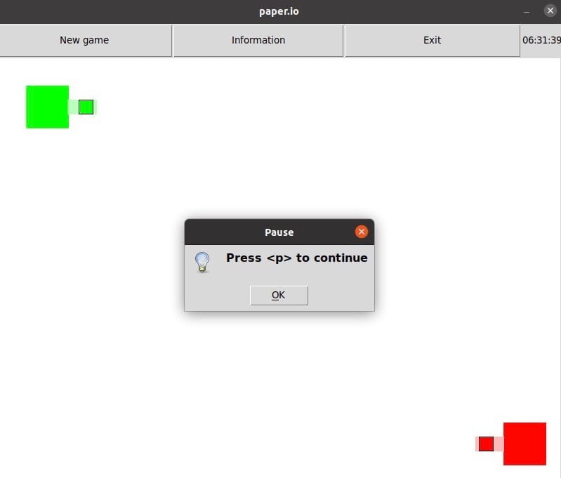
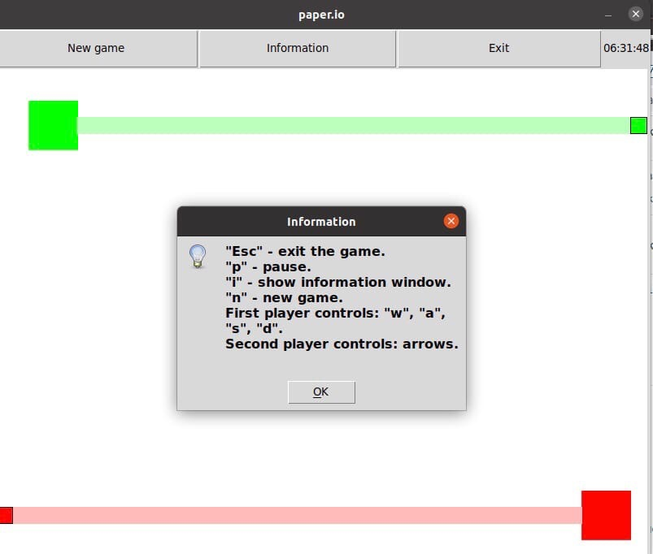
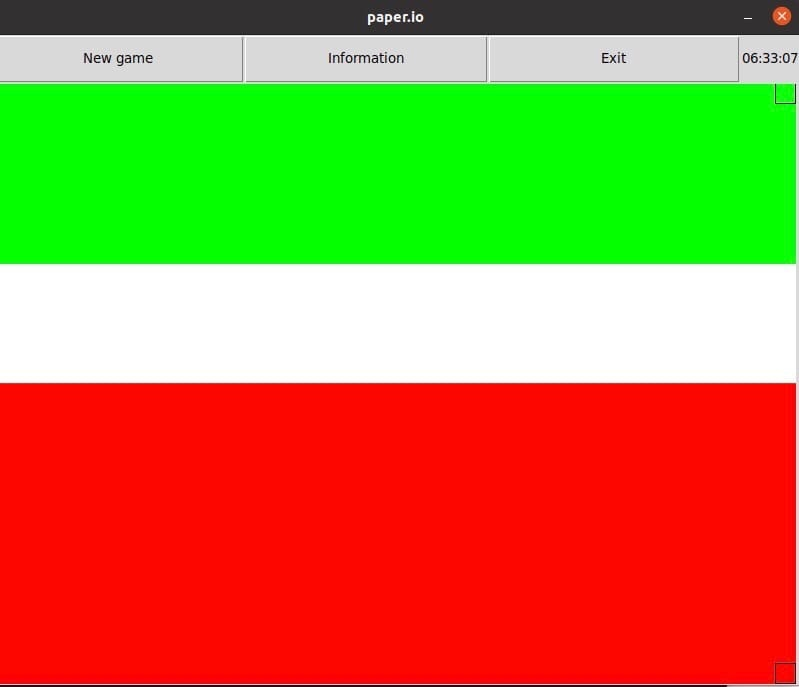

.. Paper.io documentation master file, created by
   sphinx-quickstart on Fri Jun 11 05:49:49 2021.
   You can adapt this file completely to your liking, but it should at least
   contain the root `toctree` directive.

Welcome to Paper.io's documentation!
====================================

.. toctree::
   :maxdepth: 2
   :caption: Contents:
   :numbered:

	interface
	map
	pers
	clock
	bot

Indices and tables
==================

Семестровый проект по курсу Совместная разработка на Python 2021

Участники:

    Вотинцев Алексей, 321 группа, commit name: Arrgentum
    
    Танкаев Иван, 321 группа, commit name: Ivan

Заявку на участие. Требования к проекту.

Локальный аналог игры http://paper.io. 
Прямоугольное поле нейтрального цвета. Есть два игрока - небольшие квадратики разного цвета с выделенным ободком. Они появляются каждый в своей небольшой закрашенной области. Каждый игрок может двигаться влево/вправо/вверх/вниз и наискосок. Когда игрок идёт по нейтральной территории, за ним тянется полупрозрачный след из его цвета. Если он возвращается на закрашенную своим цветом территорию, то область обведённая полупрозрачным контуром закрашивается его цветом и его область расширяется. Если до того, как игрок вернулся на свою закращенную область, соперник перешёл через его полупрозрачный след (разорвал связь игрока с его закрашенной областью), то игрок проигрывает - побеждает соперник. 
Цель - победить соперника. Управление - WASD для одного игрока, стрелочки для второго. Таким образом, возможно играть с одного компьютера двоим людям.

Краткое описание работы используемых классов:

interface.py:
Класс создает оболочку(интерфейс) для игры. В классе есть 3 кнопки - New game, Information, Exit, что соответсвенно начинают новую игру, выводят основную информацию об игре и закрывают игру. Также имеется точное время( класс Clock). Класс фиксирует нажатие всех кнопок клавиатуры и передает их в класс Map

map.py:
Класс Map реализует игровое поле. В качестве полей имеет 2 игроков и список закрашенных и полу-закрашенных клеток. Логически внутри Map всё поле делится на клетки. Методы Map позволяют получить закрашенные и полу-закрашенные клетки. Обновить положение игрока и клетки ему принадлежащие. Изменить направление движения игрока. А также осуществить движение всех игроков.

pers.py:
Player реализует одного игрока. Имеет следующие поля: *список полей просто*. А также содержит методы для чтения и изменения этих полей. И метод, осуществляющий движение игрока.

clock.py:
Clock - наследуется от label, в текстовом поле выводит точное время(время системы)

Начальное положение игроков

Окно информации об игре

Процесс игры

.. figure:: _static/5Tcv3kGuPh0.jpg
       :scale: 100 %
       :align: center
       :alt: Альтернативный текст

Окончание игры